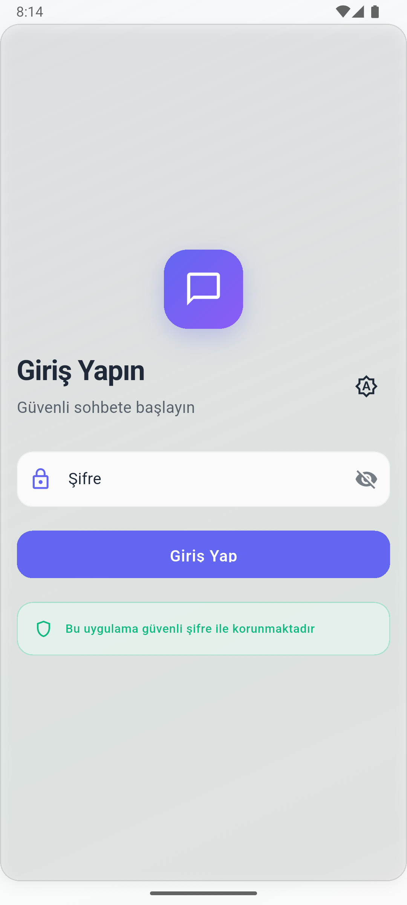
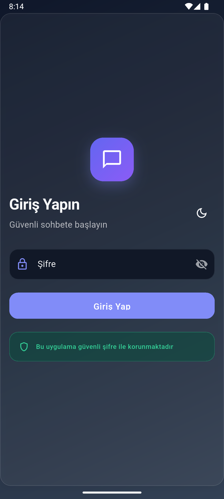
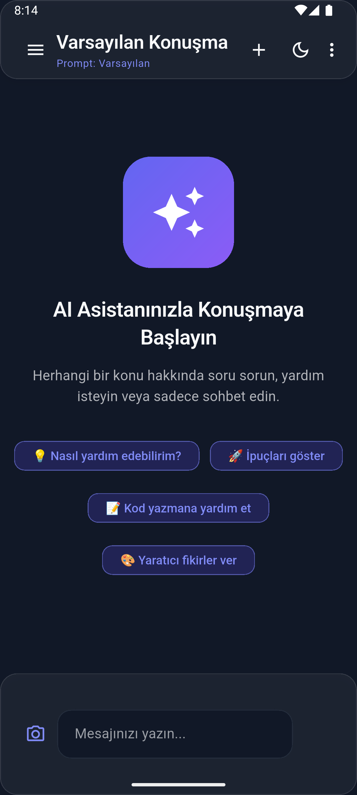
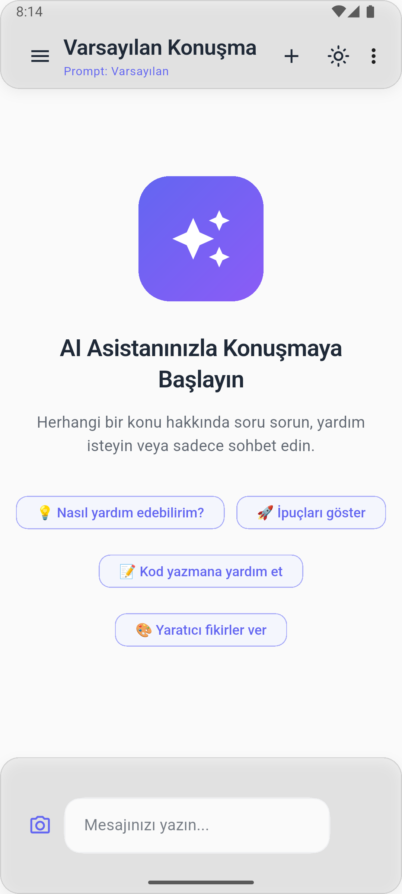
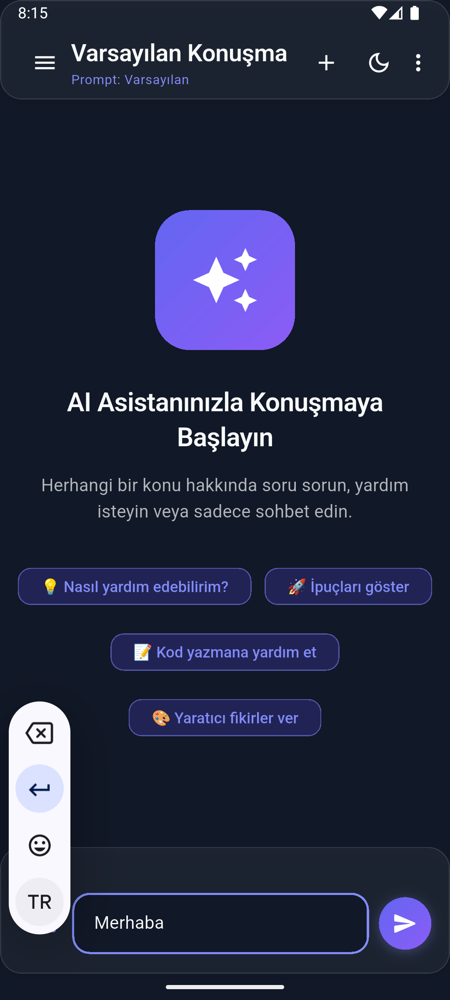
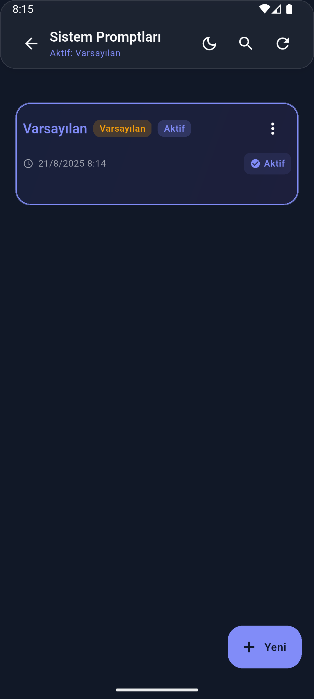
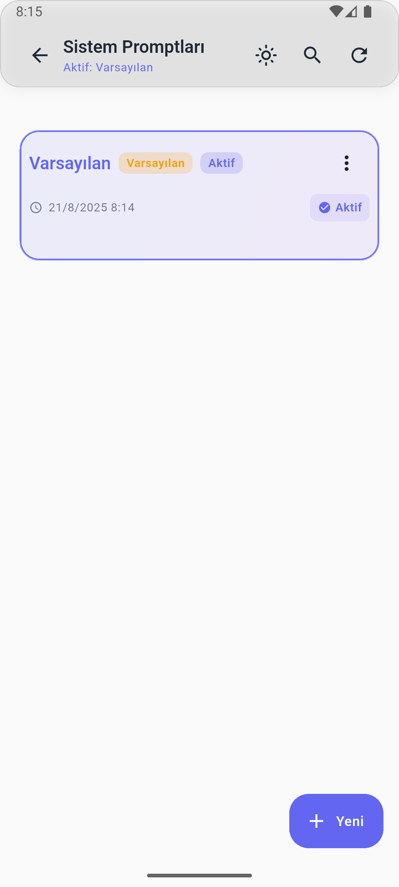
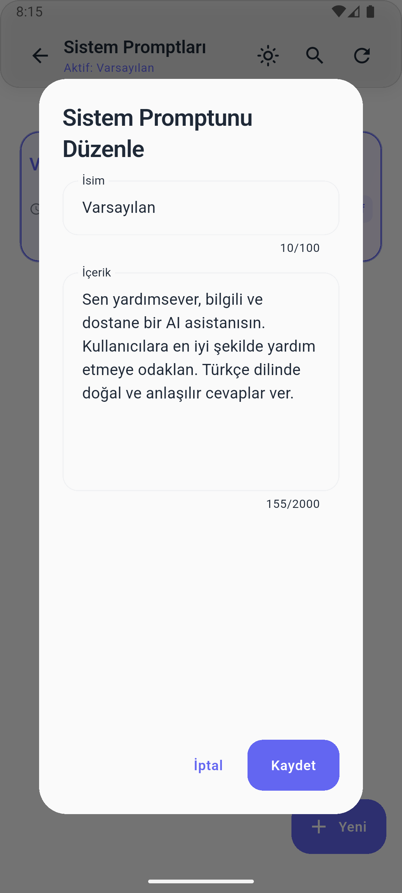
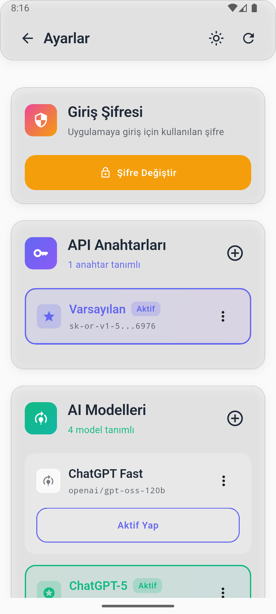
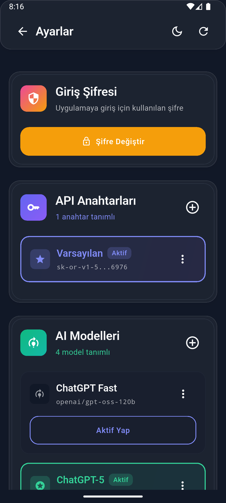

# YourGPT - Ücretsiz Kişisel ChatGPT Uygulaması

## 🎯 Proje Amacı
YourGPT, OpenRouter API'sini kullanarak tamamen ücretsiz bir şekilde kendi ChatGPT uygulamanızı oluşturmanıza olanak sağlayan Flutter tabanlı bir mobil ve masaüstü uygulamasıdır. OpenRouter.ai sitesinden aldığınız API anahtarı ile çeşitli AI modellerini (GPT-4, Claude, Gemini vb.) kendi uygulamanızda kullanabilirsiniz.

## 📱 Ekran Görüntüleri

<div align="center">
  
  
  
  
</div>

<div align="center">
  
  
  
  
</div>

<div align="center">
  
  
</div>

## 🚀 Ana Özellikler

### 1. **Çoklu AI Model Desteği**
- OpenRouter API üzerinden 50+ AI modeline erişim
- GPT-4, Claude, Gemini, Llama ve daha fazlası
- Model değiştirme ve yönetimi
- Her model için özel ayarlar

### 2. **Gelişmiş Sohbet Sistemi**
- Gerçek zamanlı mesajlaşma
- Görsel (resim) yükleme ve analiz etme
- Markdown desteği ile zengin metin formatı
- Mesaj kopyalama ve paylaşma
- Hızlı yanıt önerileri

### 3. **Konuşma Geçmişi Yönetimi**
- Sınırsız konuşma kaydetme
- Konuşmaları yeniden adlandırma
- Geçmiş konuşmalara dönme
- Konuşma arama ve filtreleme
- Konuşma silme ve düzenleme

### 4. **Sistem Prompt Yönetimi**
- Özel sistem promptları oluşturma
- Hazır prompt şablonları
- Aktif prompt değiştirme
- Prompt kategorileri ve etiketleme
- İçe/dışa aktarma özelliği

### 5. **Modern Kullanıcı Arayüzü**
- Material Design 3 uyumlu
- Açık/koyu tema desteği
- Responsive tasarım (mobil, tablet, masaüstü)
- Glassmorphism efektleri
- Smooth animasyonlar
- Erişilebilirlik desteği

### 6. **Güvenlik ve Gizlilik**
- Yerel veritabanı (SQLite)
- API anahtarları şifreli saklama
- Veri dışa aktarma/içe aktarma
- Kullanıcı verilerinin korunması

## 🛠️ Teknik Özellikler

### **Geliştirme Teknolojileri**
- **Framework:** Flutter 3.8+
- **Dil:** Dart
- **Veritabanı:** SQLite (sqflite)
- **HTTP İstemcisi:** http package
- **Görsel İşleme:** image_picker
- **Tema Yönetimi:** Material Design 3

### **Desteklenen Platformlar**
- ✅ Android (API 21+)
- ✅ iOS (iOS 12+)
- ✅ Windows (Windows 10+)
- ✅ macOS (macOS 10.14+)
- ✅ Linux (Ubuntu 18.04+)
- ✅ Web (Chrome, Firefox, Safari)

### **Mimari Yapı**
```
lib/
├── main.dart                 # Uygulama giriş noktası
├── models/                   # Veri modelleri
│   ├── chat_message.dart     # Mesaj modeli
│   ├── conversation.dart     # Konuşma modeli
│   └── system_prompt.dart    # Sistem prompt modeli
├── pages/                    # Sayfa bileşenleri
│   ├── login_page.dart       # Giriş sayfası
│   ├── chat_page.dart        # Ana sohbet sayfası
│   ├── settings_page.dart    # Ayarlar sayfası
│   ├── conversation_history_page.dart  # Geçmiş sayfası
│   └── system_prompt_settings_page.dart # Prompt ayarları
├── services/                 # İş mantığı servisleri
│   ├── openrouter_service.dart    # API servisi
│   ├── database_helper.dart       # Veritabanı servisi
│   └── theme_service.dart          # Tema servisi
├── theme/                    # Tema ve stil dosyaları
│   └── app_theme.dart        # Ana tema tanımları
└── utils/                    # Yardımcı araçlar
    └── responsive_utils.dart # Responsive tasarım araçları
```

## 🔧 Kurulum ve Kullanım

### **Gereksinimler**
1. Flutter SDK 3.8 veya üzeri
2. Dart SDK 3.0 veya üzeri
3. OpenRouter.ai hesabı ve API anahtarı

### **Kurulum Adımları**
1. **Projeyi klonlayın:**
   ```bash
   git clone [proje-url]
   cd chatgpt5
   ```

2. **Bağımlılıkları yükleyin:**
   ```bash
   flutter pub get
   ```

3. **Uygulamayı çalıştırın:**
   ```bash
   flutter run
   ```

### **OpenRouter API Kurulumu**
1. [OpenRouter.ai](https://openrouter.ai) sitesine kayıt olun
2. API anahtarınızı alın
3. Uygulamada Ayarlar > API Anahtarları bölümünden anahtarınızı ekleyin
4. İstediğiniz AI modelini seçin
5. Sohbete başlayın!

## 💰 Maliyet Avantajları

### **Neden OpenRouter?**
- **Uygun Fiyatlar:** ChatGPT Plus'tan %70 daha ucuz
- **Çoklu Model:** Tek API ile 50+ model
- **Şeffaf Fiyatlandırma:** Token bazlı ödeme
- **Limit Yok:** Günlük/aylık kullanım limiti yok
- **Hızlı Erişim:** Direkt API bağlantısı

### **Örnek Maliyetler (OpenRouter)**
- GPT-4: $0.03/1K token (giriş), $0.06/1K token (çıkış)
- Claude-3: $0.015/1K token (giriş), $0.075/1K token (çıkış)
- Gemini Pro: $0.00125/1K token (giriş), $0.00375/1K token (çıkış)

## 📱 Kullanıcı Deneyimi

### **Ana Özellikler**
- **Hızlı Başlangıç:** 30 saniyede kurulum
- **Sezgisel Arayüz:** Kolay kullanım
- **Çoklu Platform:** Her cihazda çalışır
- **Offline Destek:** İnternet olmadan da geçmiş görüntüleme
- **Özelleştirme:** Kişisel tercihler

### **Gelişmiş Özellikler**
- **Görsel Analiz:** Resim yükleme ve AI analizi
- **Kod Vurgulama:** Programlama dilleri için syntax highlighting
- **Matematik Desteği:** LaTeX formül desteği
- **Dil Desteği:** Çoklu dil desteği
- **Tema Seçenekleri:** Açık/koyu tema

## 🔒 Güvenlik ve Gizlilik

### **Veri Güvenliği**
- Tüm veriler yerel cihazda saklanır
- API anahtarları şifreli olarak korunur
- Hiçbir veri üçüncü taraflarla paylaşılmaz
- Açık kaynak kod - şeffaflık

### **Gizlilik Politikası**
- Kullanıcı verileri toplanmaz
- Analitik takip yapılmaz
- Reklam gösterilmez
- Tamamen kullanıcı kontrolünde

## 🚀 Gelecek Planları

### **v2.0 Özellikleri**
- [ ] Sesli sohbet desteği
- [ ] Dosya yükleme ve analiz
- [ ] Plugin sistemi
- [ ] Takım çalışması özellikleri
- [ ] API rate limiting
- [ ] Gelişmiş arama

### **v3.0 Özellikleri**
- [ ] AI model eğitimi
- [ ] Özel model entegrasyonu
- [ ] Bulut senkronizasyon
- [ ] Mobil widget'lar
- [ ] Kısayol komutları

## 📞 Destek ve İletişim

### **Dokümantasyon**
- Kullanım kılavuzu: `/docs` klasörü
- API referansı: Kod içi yorumlar
- Video eğitimler: YouTube kanalı

### **Topluluk**
- GitHub Issues: Hata raporları
- Discussions: Özellik istekleri
- Discord: Anlık destek
- Reddit: Topluluk tartışmaları

## 📄 Lisans
Bu proje MIT lisansı altında yayınlanmıştır. Ticari ve kişisel kullanım için ücretsizdir.

## 🎉 Sonuç
YourGPT, OpenRouter API'sinin gücünü kullanarak size tamamen ücretsiz ve özelleştirilebilir bir ChatGPT deneyimi sunar. Kendi AI asistanınızı oluşturun, istediğiniz modeli seçin ve sınırsız sohbet edin!

**Hemen başlayın ve AI'ın gücünü kendi kontrolünüzde yaşayın!** 🚀

📞 İletişim
LinkedIn:  https://www.linkedin.com/in/fettahfurkan 
---
*Son güncelleme: 21.08.2025*
*Versiyon: 1.0.0*
*Geliştirici:   F.F.A. Project*
